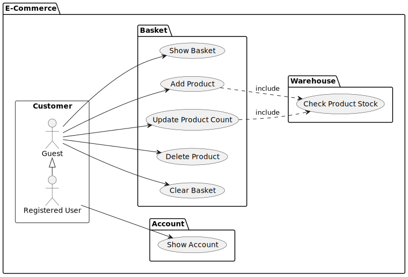
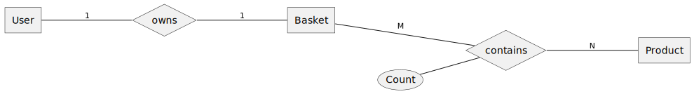
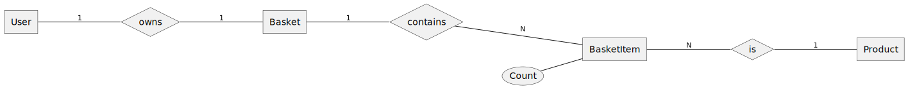

# Clean Architecture (Go)

This is an example implementation of an E-Commerce basket 
using Uncle Bobs' Clean Architecture written in Go.


Source: https://blog.cleancoder.com/uncle-bob/2012/08/13/the-clean-architecture.html

## E-Commerce Basket

### Use Case Diagram



### ER Diagram

Simple Model:



With adapted Basket:



### Implementation

The golang project structure is based on http://github.com/golang-standards/project-layout.

All code, except the `cmd` entrypoint, is "hidden" inside the `internal` directory.

Using a domain-driven design approach, the domains are separated inside the `internal/domain` directory.

The high-level layers "Entities" and "Use Cases" are combined inside the `business` directory.

The low-level layers "Adapters" and "Drivers" are separated.

#### Entities

The entities are stored inside this layer.

Also, there are Factory classes
to create new entities and Repository classes
to retrieve entities from the data layer and save entities into the data layer.

#### Use Cases

The use cases are stored inside this layer.

Every Use Case has a separate class which improves the readability and understandability.

Also, there are additional Service classes containing more business logic.

And for the output, there are some "Data Transfer Object" (DTO) classes. 

#### Adapters

The interface adapters are stored inside this layer.

The implemented adapters are a full REST API and a web adapters, but only for the "Show Basket" use case.

#### Drivers

The drivers are stored inside this layer.

The implemented drivers are an in-memory driver, but for the basket there is also a MongoDB driver.

## Start application

### Start application using Go

```shell
go run ./cmd/server
```

### Start application using Docker

First build the docker image:

```shell
./docker-build.sh
```

Then run the docker container using the built image:

```shell
./docker-run.sh
```

## Usage

### Web

The web implementation only shows the basket. (first use case)

To view it, open http://localhost:8080/ in your web browser.

If you want to interact with the basket, please use the REST API described in the following section.

### REST API

The REST API fully implements all basket use cases with the following routes:

```shell
GET    /basket
POST   /basket/:productId
POST   /basket/:productId/:count
PATCH  /basket/:productId/:count
DELETE /basket/:productId
DELETE /basket
```

If you use `curl` in the shell, you can use [jq](https://github.com/jqlang/jq) to prettify the output.

#### Show Basket

```shell
curl http://localhost:8080/basket
```

#### Add first product A12345 with default count=1 to the basket

```shell
curl -XPOST http://localhost:8080/basket/A12345
```

#### Add more of product A12345 with count=2 to the basket

```shell
curl -XPOST http://localhost:8080/basket/A12345/2
```

#### Set count of the existing product A12345 in the basket to 10

```shell
curl -XPATCH http://localhost:8080/basket/A12345/10
```

#### Add product A12346 to the basket

```shell
curl -XPOST http://localhost:8080/basket/A12346/1
```

#### Delete product A12346 from the basket

```shell
curl -XDELETE http://localhost:8080/basket/A12346
```

#### Clear the basket

```shell
curl -XDELETE http://localhost:8080/basket
```

## Maintenance

### Recreate diagrams

The diagrams are built using `plantuml`.

To recreate them, just run:

```shell
./recreate-diagrams.sh
```
