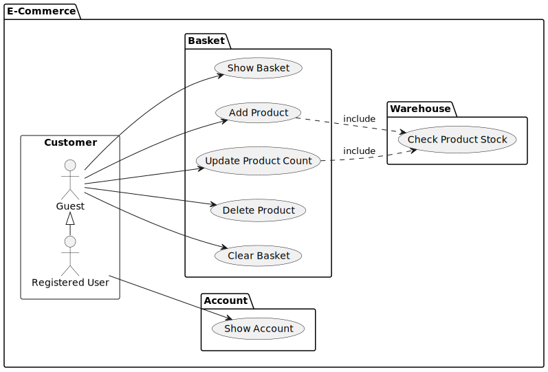

# clean-architecture-go

This is an example implementation of an E-Commerce basket 
using Uncle Bobs' Clean Architecture.

Please keep in mind that this is a demo application
and some things would be implemented differently in a real world application.


Source: https://blog.cleancoder.com/uncle-bob/2012/08/13/the-clean-architecture.html

## E-Commerce Basket

### Use Case Diagram



### Data Model

todo

### Implementation

todo

## Start application

### Start application using Go

```shell
go run ./cmd/server
```

#### Start application using Docker

First build the docker image:

```shell
./build.sh
```

Then run the docker container using the built image:

```shell
./run.sh
```

## Usage

### Web

The web implementation only shows the basket. (first use case)

To view it, open http://localhost:8080/ in your web browser.

If you want to interact with the basket please use the REST API described in the following section.


### REST API

The REST API fully implements all basket use cases.

```shell
GET /basket
POST /basket/:productId
POST /basket/:productId/:count
PATCH /basket/:productId/:count
DELETE /basket/:productId
DELETE /basket
```

If you use `curl` in the shell, you can use `jq` to prettify the output.

#### Show Basket

```shell
curl http://localhost:8080/basket
```

#### Add first product A12345 with default count=1 to the basket

```shell
curl -XPOST http://localhost:8080/basket/A12345
```

#### Add more of product A12345 with count=2 to the basket

```shell
curl -XPOST http://localhost:8080/basket/A12345/2
```

#### Set count of the existing product A12345 in the basket to 10

```shell
curl -XPATCH http://localhost:8080/basket/A12345/10
```

#### Add product A12346 to the basket

```shell
curl -XPOST http://localhost:8080/basket/A12346/1
```

#### Delete product A12346 from the basket

```shell
curl -XDELETE http://localhost:8080/basket/A12346
```

#### Clear the basket

```shell
curl -XDELETE http://localhost:8080/basket
```

## Maintenance

### Recreate diagrams

The diagrams are built using `plantuml`.

To recreate them, just run:

```shell
./recreate-diagrams.sh
```
